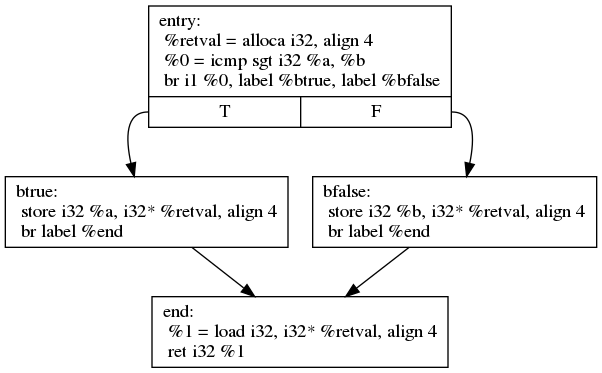

## Simple "if-then-else" Branching

First let's take a look at a very simple function, that computes the maximum of
two integers. This is implemented using a single if control statement.



Remember that in LLVM IR control-flow is implemented by jumping between *basic
blocks*, which contain instruction sequences that do not change control flow.
Each basic block ends with an instruction that changes the control flow. The
most common branching instruction is `br`<sup>[1](#br-link)</sup>. `br` can be
used conditionally, then it implements a simple if-then-else, taking a boolean
condition flag and two basic block labels as parameter.
```llvm
br i1 <cond>, label <iftrue>, label <iffalse>
```
`br` can also be used to unconditinally jump to a certain destination:
```llvm
br label <dest>
```



In the example above, there are 4 basic blocks. The first one is the function
entry block. There space is allocated on the stack with `alloca`, which acts as
a temporary storage for the bigger value. Then the two paramter `%a` and `%b`
are compared using the `icmp`<sup>[2](#icmp-link)</sup> instruction. The result
is a boolean (`i1`) flag, which is then used as condition for the `br`
instruction. Then depending on the taken branch, either `%a` or `%b` is stored
into the temporary `%retval` variable. Each of the branches then end with a
unconditional branch to the last basic block `%end`. There the value from
`%retval` is loaded and returned.


You can get a graphical representation of the control-flow in the form of a
control-flow graph (CFG). This can be generated by using `opt -dot-cfg input.ll`.




LLVM IR is a rather rich intermediate code format. So when compiling the above
snippet with higher optimization levels, LLVM will optimize the code to use the
`select` instruction<sup>[3](#select-link)</sup> instead of generating
branches. The `select` instruction simply chooses between two values, based on
a boolean condition. This shortens the code significantly.




<a name="br-link">1</a>: [LangRef: br](http://llvm.org/docs/LangRef.html#br-instruction)  
<a name="icmp-link">2</a>: [LangRef: icmp](http://llvm.org/docs/LangRef.html#icmp-instruction)  
<a name="select-link">3</a>: [LangRef: select](http://llvm.org/docs/LangRef.html#select-instruction)  

